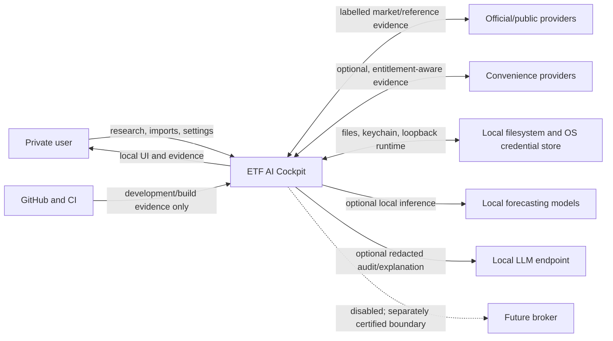
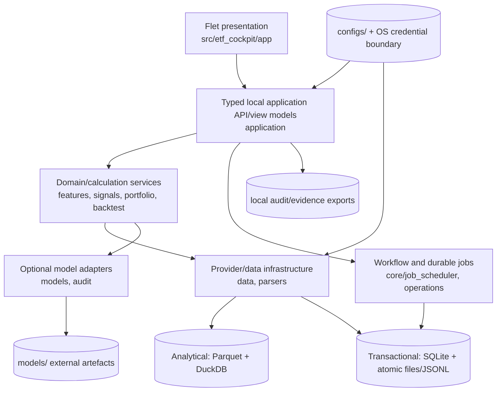
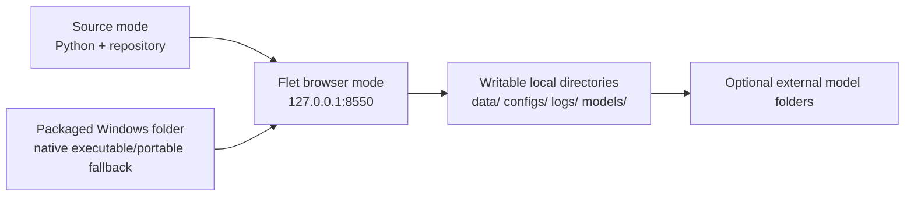
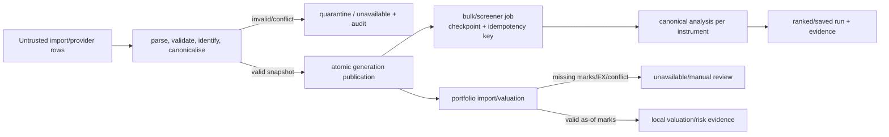
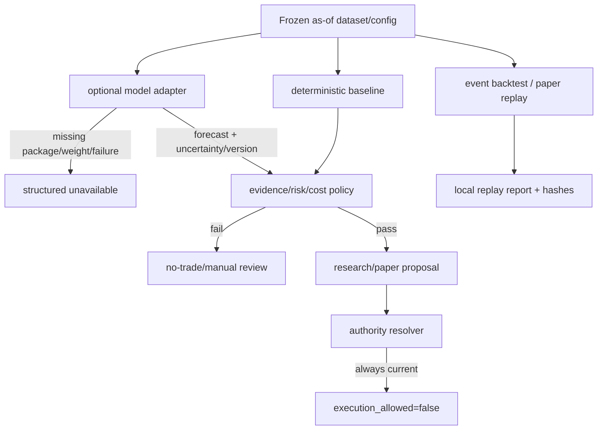

# ETF AI Cockpit Software Design Description

This document uses five evidence states: **VERIFIED CURRENT** (present and
checked at the commit above), **PARTIALLY IMPLEMENTED** (a usable slice exists
but the canonical programme requires more), **TARGET / PLANNED** (accepted
future behaviour), **BLOCKED** (a dependency or evidence gate prevents
progress), and **LEGACY** (retained compatibility or history).

## 1. Purpose, audience and source precedence

This is the current architecture authority for the private local-first
investment-research repository. It serves maintainers, product owners,
reviewers, security and release engineers. The
[issue registry](../../issues/issue_registry.json) owns issue identity,
dependencies and status; [current status](../product-completion/CURRENT_STATUS.json)
is its generated summary; [batch plans](../../plans/) own run state;
[ADRs](decisions/README.md) own major decision rationale; code, configuration
and tests provide executable evidence.

Apply the precedence in the repository `AGENTS.md`. A material conflict among
binding sources blocks only the affected claim: record it, retain explicit
unavailable behaviour and do not silently choose. Update this SDD and any
affected ADR in the same change as an architectural boundary, schema, typed
contract, time semantic, canonical calculation, authority/trust boundary,
deployment or major runtime-flow change. This structure is informed by
ISO/IEC/IEEE 42010 and 29148, arc42, C4 and lightweight ADR practice; no formal
certification is claimed.

## 2. Product goals and quality goals

The product is private, local-first research and decision support for stocks,
ETFs, ordinary funds, supported fixed income and locally represented cash/FX.
Individual analysis and bulk/top-N screening are primary; portfolio
intelligence is a separate capability. Paper and broker-read-only lanes require
their own evidence. Any later execution lane requires separate approval and
certification. The product does not guarantee performance. Models and LLMs
never receive execution authority.

Observable quality goals are: deterministic calculation tests; point-in-time
queries without look-ahead; versioned inputs and reproducible replay; hashed,
redacted audit evidence; explicit missing/stale/conflicted/unsupported states;
reason codes and source-labelled explanations; no silent upload; fail-closed
security and recovery; atomic/checkpointed persistence; budgets enforced from
[`configs/performance_budgets.yaml`](../../configs/performance_budgets.yaml);
keyboard/semantic UI contracts; Windows source/package portability; and
versioned compatibility/migration rather than implicit rewriting.

## 3. Constraints and non-goals

**VERIFIED CURRENT:** Windows-first local deployment; Python `>=3.11`; Flet
local browser/runtime; Pandas/NumPy/PyArrow/DuckDB/Pydantic/YAML/SQLite-backed
local services as declared in [`pyproject.toml`](../../pyproject.toml). The
normal browser binds to loopback. Optional parser/model dependencies and
external TimesFM/Toto weights are not baseline requirements. Lawful free/public
sources have coverage, freshness and licensing limits; no paid provider is
mandatory and no cloud upload is silent.

Live broker write is outside current authority. Normal paths exclude shorting,
leverage, derivatives, crypto and unsupported complex products. Tax advice and
personalised suitability advice are non-goals unless a later approved contract
adds them. `execution_allowed=false`.

## 4. System context



Provider data is untrusted until validated and attributed. GitHub/CI is
development infrastructure, not a user runtime dependency.

## 5. Container and deployment views



The hybrid design is **VERIFIED CURRENT**: immutable, checksum-catalogued
Parquet generations support analytical reads; SQLite, append-only event stores
and atomic files support transactional state. Older file-backed stores remain
**LEGACY/transitional**, not an alternative architecture authority.



Source mode uses `scripts/run_app.py`; packaged mode uses
`scripts/build_windows.bat` and the release-candidate launchers. Writable state
stays outside immutable executable payloads. The loopback listener is the
network trust boundary; no public HTTP API is enabled.

## 6. Building-block view

| Block | Responsibility and public contracts | Dependency rule | Principal paths / tests | State |
|---|---|---|---|---|
| Domain | typed evidence, identity, features, scores, risk, portfolio and replay | no Flet or concrete provider dependency | `core/types.py`, `data/contracts.py`, `features/`, `signals/`, `portfolio/`, `backtest/`; deterministic tests | VERIFIED CURRENT / transitional layout |
| Application | orchestration, typed commands/queries, serialisable view models | may call domain ports; must not expose frames/domain objects to UI | `application/contracts.py`, `api.py`, `ui_facade.py`; `tests/test_application_api.py` | PARTIALLY IMPLEMENTED |
| Infrastructure | providers, parsers, stores, migrations, credentials | implements contracts; cannot grant authority | `data/`, `parsers/`, `security/`, `operations/`; provider/storage tests | VERIFIED CURRENT |
| Presentation | routes, workspaces, pages, selectors and components | calls application facades; no canonical formulas | `app/router.py`, `app/pages/`, `app/selectors/`; UI/acceptance tests | PARTIALLY IMPLEMENTED |
| Shared core/contracts | paths, atomic I/O, versioning, workflow, errors, acceptance metadata | stable, versioned and infrastructure-neutral where practical | `core/`, `governance/models.py`; core/governance tests | VERIFIED CURRENT |
| Tests and validation | contract, invariant, UI, control and release evidence | may inspect boundaries; cannot weaken controls | `tests/`, `scripts/validate_app.py`, policy checkers | PARTIALLY IMPLEMENTED |

The repository retains older `services.py`, direct data modules and page/state
integration as transitional compatibility. The architecture-boundary checker
and ongoing ISSUE-0136–0140 work prevent that from being represented as a
completed refactor.

## 7. Runtime views

### 7.1 Safe startup and first run

```mermaid
sequenceDiagram
  actor User
  participant Launcher
  participant App as Flet/Application
  participant Store as Local stores
  participant Calc as Deterministic analysis
  User->>Launcher: start source or package
  Launcher->>App: loopback startup
  App->>Store: validate config/schema; recover last valid state
  Store-->>App: snapshot or explicit unavailable/corrupt state
  User->>App: analyse one instrument
  App->>Calc: identity + as-of snapshot + profile/horizon
  Calc-->>App: versioned facts/features/score/gates
  App-->>User: source-labelled view and local audit evidence
```

**Inputs:** launcher mode, local settings and existing writable directories.
**Boundary:** settings/universe revisions and the last valid local store.
**Services:** `scripts/run_app.py`, `core/runtime.py`, `app/flet_app.py` and
`services.build_snapshot()`. **Persistence:** `data/`, `configs/`, `logs/` and
local migration/recovery state. **Failure:** first run can create deterministic
sample data; corrupt state fails closed and optional providers/models are
unavailable rather than mandatory. **Audit:** startup diagnostics and
`logs/session.jsonl`. This flow is **VERIFIED CURRENT**.

The persisted universe store schema v3 is an additive extension of the local
revisioned store. It adds checksum-protected, per-record `policy_profiles` with
source, as-of, authority, coverage, classification-confidence and dependency
evidence. Schema-v0/v2 stores remain readable and expose records as
`legacy_unmigrated`; an ordinary edit does not automatically backfill or
mutate those profiles. A changed policy version produces explicit
`stale`/recompute-required evidence. Policy profiles and backfill plans retain
`execution_allowed=false`.

### 7.2 Single-instrument analysis

**Inputs:** instrument identity, horizon/profile and point-in-time prices,
classification and evidence. **Boundary:** settings/universe revisions plus
the resolved evidence as-of time; the transitional aggregate is
`services.CockpitSnapshot`, while typed evidence and score results live in
`core/types.py`, `signals/canonical_scoring.py` and application view models.
**Services:** `application/ui_facade.py`, feature services and signal/scoring
services. **Persistence:** validated local evidence, feature/score history and
exports. **Failure:** missing adjusted prices, FX, identity or chronology yields
unavailable/manual review. **Audit:** source-labelled metrics, reason codes,
versions and local export evidence. This flow is **PARTIALLY IMPLEMENTED**
across legacy and typed application surfaces.

### 7.3 Bulk and screener run



**Inputs:** frozen universe, filters/top-N request, horizon/profile/depth and
provider snapshot. **Boundary:** run ID, universe/settings revision and frozen
input hashes. **Services:** `application/screening.py`,
`application/screening_data.py`, `data/screen_store.py` and durable job
services. **Persistence:** checkpoints, cached datasets and saved screen/run
records. **Failure:** per-instrument unavailable results remain explicit;
interruption resumes idempotently. **Audit:** ranked candidates, exclusions,
source snapshots, progress and run identity. This flow is **PARTIALLY
IMPLEMENTED**.

### 7.4 Data import and canonicalisation

**Inputs:** untrusted local files or labelled provider responses. **Boundary:**
source/retrieval identity, schema version, content hash and point-in-time
chronology. **Services:** `data/import_pipeline.py`, provider/parser adapters,
identity/classification and source-conflict services. **Persistence:** atomic
clean stores, quarantine/evidence records and immutable analytical
generations. **Failure:** malformed, conflicted, stale or identity-ambiguous
input is rejected or marked unavailable; no zero-fill occurs. **Audit:** source
hash, validation/conflict reasons and publication identity. This flow is
**VERIFIED CURRENT** for implemented asset/provider contracts.

### 7.5 Portfolio valuation and analysis

**Inputs:** local holdings/imports, as-of adjusted marks, FX and portfolio
policy. **Boundary:** portfolio revision and valuation evidence snapshot.
**Services:** `application/portfolio_imports.py`, `portfolio/holdings.py`,
`portfolio/risk.py` and related facades. **Persistence:** local portfolio
imports, ledger/evidence and reports. **Failure:** missing marks/FX, conflicts
or unsupported assets produce unavailable/manual review and cannot imply
suitability. **Audit:** positions, valuation sources, exposures, warnings and
policy versions. This flow is **PARTIALLY IMPLEMENTED**.

### 7.6 Backtest and paper replay



**Inputs:** frozen as-of data, strategy/configuration and explicit cost/fill
assumptions. **Boundary:** dataset, settings, formula/policy and run hashes.
**Services:** `backtest/event_engine.py`, `backtest/engine.py` and
`portfolio/paper_trading.py`. **Persistence:** replay reports and append-only
local paper ledger. **Failure:** look-ahead, unsupported evidence or
reconciliation failure rejects the run. **Audit:** event/fill history, costs,
benchmarks, ledger hashes and `execution_allowed=false`. This flow is
**PARTIALLY IMPLEMENTED**; paper activity is simulation only.

### 7.7 Optional model invocation and unavailable fallback

**Inputs:** validated feature snapshot, model configuration and optional local
checkpoint. **Boundary:** input, model/checkpoint, calibration and settings
versions. **Services:** `models/registry.py`, `models/timesfm_adapter.py`,
`models/toto_adapter.py` and deterministic baseline models. **Persistence:**
forecast records and diagnostics; external weights stay under optional model
folders. **Failure:** missing package, weight or runtime returns structured
unavailable evidence while the baseline continues. **Audit:** model identity,
uncertainty, availability and diagnostics. This flow is **VERIFIED CURRENT**
for adapter/fallback semantics, with broader calibration **PARTIALLY
IMPLEMENTED**.

### 7.8 Proposal and authority decision

**Inputs:** deterministic analysis, forecast evidence, costs, eligibility,
risk and proposal policy. **Boundary:** evidence snapshot plus policy and
authority-matrix versions. **Services:** `portfolio/proposal_policy.py`,
`governance/gate_policy.py`, `governance/capability_scope.py` and typed
application proposal contracts. **Persistence:** local proposal/review or paper
evidence only. **Failure:** any missing/conflicted gate blocks or requires
manual review; UI/model/LLM output cannot bypass it. **Audit:** gate reasons,
policy checksums, proposal state and literal `execution_allowed=false`. This
flow is **PARTIALLY IMPLEMENTED** and has no broker-write authority.

## 8. Core data and behavioural contracts

Entity, fund, share-class, security and listing identity are separate concepts
implemented across `data/identity_master.py` and `instrument_identity.py`.
Canonical identity is stable; listings and provider aliases are evidence, not
the entity key. Bitemporal records retain valid and knowledge chronology plus
publication/acceptance/retrieval and revisions where their contract supplies
them. Source policy selects only eligible evidence and preserves conflicts.

Returns require adjusted, corporate-action-aware total-return evidence.
Instrument classification determines compatible metrics, peers and strategy
scope. The current aggregate is the transitional `CockpitSnapshot` in
`services.py`; canonical typed evidence and score contracts are defined in
`core/types.py` and `signals/canonical_scoring.py`, then projected through
application view models. Score engine v3 and forecast records carry provenance,
uncertainty and unavailable states. Portfolio and paper ledgers use
append-only/revision-protected identities and explicit valuation evidence.
Jobs use stable IDs, idempotency keys, dependency graphs and checkpoints.
Audit/config/model/policy artefacts record schema or policy versions and hashes.

Peer cohort contract `peer-cohort.v1` resolves ISSUE-0083 classification at
the run's exact effective and decision cut-offs in the data boundary, then
passes frozen contexts to storage-independent analysis. Its local immutable
store authenticates one schema-versioned canonical result containing universe,
adapter, hierarchy, exclusions, statistics and authority lineage; append and
read paths independently rebuild calculations before accepting replay.
Mismatched chronology, unresolved classification, corrupted lineage and
non-canonical hashes fail closed, and every projection retains
`execution_allowed=false`.

Persisted/hashed contracts follow one rule: schema/version plus canonical
identity participate in validation; a repeated identity with different content
is rejected; readers support only declared compatible versions; migrations are
explicit, atomic and recoverable; unknown/corrupt/incomplete state fails closed;
and replay resolves the original snapshot/config/model/policy versions.
[Versioned lineage](versioned-lineage-registry.md),
[storage](hybrid-local-data-platform.md), [API](application-api.md), and their
linked tests are the detailed authorities.

**Current risk — ISSUE-0153:** the issue is `in_progress` at the verified base.
The [stopped implementation evidence](../../plans/BATCH-B03-FIXED-INCOME.md)
records the protected identity-contract transition. Identity claims retain
`retrieved_at` as immutable chronology: exact duplicates are idempotent, while
otherwise-identical observations retrieved at different times remain distinct
and are excluded from earlier decision-time replay. Identity decision hashes
use schema version 2 when retrieval chronology participates in the payload;
callers may explicitly request deterministic legacy version-1 replay, and
unknown versions fail closed. Stored version-1 claims remain readable without
inventing missing retrieval evidence. `execution_allowed` remains false.

ISSUE-0153 adds `fixed-income-terms.v1` as an append-only contract in the
existing transactional store. `FixedIncomeSecurityTerms`,
`SettlementConvention`, `OptionalitySchedule`, `CouponSchedule` and
`RedemptionSchedule` cover only declared fixed-rate and zero-coupon government
or corporate bonds. Writes require an existing shared identity-master
security; payment-date and ex-coupon adjustment consume certified
`MarketCalendarService` settlement evidence. Valid/knowledge/retrieval times,
source hashes, immutable corrections and overlays support point-in-time replay.
Conflicted critical terms, uncertified calendars and floating, linked,
optional, amortising, convertible, perpetual or structured features quarantine
the schedule and keep pricing, screening, proposals and execution disabled.
The application API/facade projects the same read-only terms, schedules,
history, lineage and capability state rendered by Instrument Detail; the page
does not calculate cash flows.
See the [phase record](../product-completion/programme/phases/phase-02-data-policy-identity.md)
and canonical registry; status and full acceptance criteria are not duplicated
here.

## 9. Calculation and model authority

Authority is strictly ordered:

1. deterministic calculations produce reproducible facts, features, costs and
   risk;
2. statistical/ML models produce forecasts with uncertainty and calibration;
3. LLMs may extract, audit or explain labelled evidence;
4. risk and eligibility policy can block;
5. portfolio/proposal policy can constrain a non-executable proposal;
6. execution authority remains independently disabled.

Adjusted total-return data is mandatory. Models never replace deterministic
calculations; absent models yield unavailable results. Evidence, risk, cost and
authority gates outrank forecasts. Asset families keep asset-specific metrics
and peers; cross-asset comparison is limited to compatible return, risk,
liquidity, cost, evidence and portfolio-impact fields. Formula detail belongs
in [`configs/feature_registry.yaml`](../../configs/feature_registry.yaml),
[`configs/score_engine_v3.yaml`](../../configs/score_engine_v3.yaml),
[canonical scoring](canonical-score-engine-v3.md), and executable tests.

## 10. Security, privacy and trust boundaries

User state remains local unless the user explicitly exports it. Secrets belong
in environment/OS credential storage or an encrypted adapter, never logs,
diagnostics or audit packets. Network responses, imports, archives, XML/PDF,
symlinks and filenames cross untrusted parser/file boundaries and are
size/type/path checked. Source policy records licence and retention limits.
Model/checkpoint identity is verified before use. Redaction precedes persisted
diagnostics and exports; audit packets exclude secrets and unnecessary private
inputs.

Backups checkpoint transactional stores and verify integrity; restore and
migration preserve the last valid state. Loopback access, disabled broker
execution and capability-stage transitions are explicit trust boundaries.
Unknown policy, corrupt data, missing chronology, credential-store failure,
critical security findings and authority ambiguity fail closed. See
[security policy](security-policy.md) and
[privacy/backup/recovery](privacy-backup-recovery.md).

## 11. Quality scenarios and budgets

| Scenario | Required observable response |
|---|---|
| stale/conflicted evidence | exclude or label unavailable/manual review; retain conflict provenance |
| offline startup | baseline UI starts from local/sample/cache state; providers/models show unavailable |
| unavailable model | deterministic baseline continues; no fabricated forecast |
| interrupted bulk job | checkpoint, recover and resume idempotently |
| concurrent persistence | lock/revision conflict; no partial publication or lost committed state |
| corrupted local data | quarantine/fail closed and recover last valid backup/snapshot |
| source/package parity | same contracts, authority and representative outputs in smoke evidence |
| large universe | remain within versioned budgets; paginate/cache and keep UI responsive |
| recovery/replay | reproduce from recorded snapshot/config/model/policy identities |
| malicious import | reject traversal, symlink, oversized/decompression and malformed content |
| credentials | redact recursively; never include plaintext in evidence |
| financial reconciliation | exact cash/ledger identities and declared numerical tolerances pass |
| accessibility | labelled controls/tables, keyboard operation, focus and unambiguous units |

Numerical and performance budgets are not restated: the current authority is
[`configs/performance_budgets.yaml`](../../configs/performance_budgets.yaml)
and [performance budgets](performance-budgets.md).

## 12. Validation and release architecture

Focused unit/contract tests lead; property, metamorphic, golden and differential
tests cover critical invariants where implemented. UI acceptance inventory is
versioned in `configs/ui_acceptance.yaml`. Source and packaged smoke, Windows
and Linux gates, SBOM, signing, privacy, security, legal and supply-chain checks
are capability-specific evidence, not proof that the whole programme is done.

Current commands include:

```text
python -m pytest tests -q
python scripts/check_architecture_boundaries.py
python scripts/generate_issue_registry.py --check
python scripts/validate_issue_registry.py
python scripts/update_programme_status.py --check
python scripts/validate_app.py --changed
python scripts/validate_app.py --offline
python scripts/validate_app.py --full
python scripts/validate_app.py --packaged
```

Protected promotion adds package/source parity, release-manifest/SBOM/signature
and required CI evidence. Status transitions fail on stale base, unexpected
downgrade or file; GitHub issue apply requires a reviewed checksum and final
zero-action readback. See [validation protocol](validation-protocol.md),
[release gate](release-gate.md) and [release certification](release-certification.md).

## 13. Current state, gaps, risks and technical debt

At commit `6525429d56160167fbeb023636f8b00b05e28336` on 2026-07-27, the canonical
summary contains 197 records: 17 closed, 41 integrated, 58 initially
implemented, 8 in progress, 4 requiring hardening, 66 planned, 2 research-only
and 1 blocked. These counts are dated evidence only; follow
[current status](../product-completion/CURRENT_STATUS.json) for current truth.

Architecture-relevant gaps are: ISSUE-0153 chronology/hash identity risk and
its dependent chain; transitional presentation/application and file-store
compatibility; incomplete multi-asset, portfolio and UI parity; package/browser
limitations and optional local environment gaps; and capability certification
still incomplete. ISSUE-0152 final certification is **BLOCKED**. The legacy MVP
specification was documentation drift and is now **LEGACY**. Recent merged work
established the B00 control plane, policy boundaries and initial identity/data
slices; it does not make planned issue contracts current.

## 14. Architectural decisions

The [ADR index](decisions/README.md) records accepted layered, point-in-time,
hybrid-persistence and canonical-snapshot decisions.
[ADR-0070](ADR-0070-product-scope-and-authority.md) remains the accepted
local-first product-scope, optional-enrichment and staged-authority record;
those subjects are deliberately not duplicated. Proposed future
broker designs under `future/` are **TARGET / PLANNED**, not accepted execution
authority.

## 15. Traceability and glossary

[TRACEABILITY.md](TRACEABILITY.md) maps architecture families to issues, code,
configuration and tests.

| Term | Meaning |
|---|---|
| adjusted total return | price evidence adjusted for corporate actions and distributions as required by the contract |
| as-of / valid time | when a fact applies in the market or business domain |
| knowledge time | when the system could legitimately know the fact |
| acceptance/retrieval time | when evidence passed intake / was obtained |
| snapshot | immutable identity for the evidence and versions used in one result |
| unavailable | explicit absence or failed eligibility; never zero |
| canonical | the single versioned implementation/identity used across surfaces |
| proposal | advisory or paper artefact with no broker-write authority |
| certification lane | independently gated capability such as research, paper or broker read-only |
| programme status | registry-owned implementation evidence state, not runtime authority |

## Fixed-income analytics contract

`fixed-income-analytics.v1` is the canonical deterministic calculation
contract for supported fixed-rate and zero-coupon bonds. Application and UI
surfaces consume its serialized result and never recalculate bond formulas.
Yield and curve compounding/day-count conventions are explicit and remain
separate.
Missing typed curve evidence produces a `partial` result with
`curve_status=unavailable`; price/yield facts remain usable while curve model
values and scenarios remain unavailable. Invalid, conflicted, or future-known
evidence fails closed.

The local `data/analytics/bond_analytics.parquet` file is an atomic analytical
projection of immutable version-1 records serialized through the repository
transactional store. Publication holds the transactional write lock while it
projects the complete retained history, so concurrent distinct appends cannot
silently replace each other and a failed publication preserves the preceding
valid generation. Record identity is immutable; exact retries are idempotent
and changed content under the same identity is rejected. Each row binds the
typed input hash and result checksum, and reads reconstruct the input and
re-run the canonical calculator before returning data. Unknown or altered
schemas, hashes, authority, chronology, or results fail closed.

## Fixed-income component risk

`fixed-income-risk.v1` is the canonical local, immutable component and scenario
contract for supported bonds. It reuses `fixed-income-analytics.v1` for every
full reprice and records duration/convexity approximation, full-reprice P&L,
discrepancy and currency units. Parallel and exact curve-node key-rate shocks
are supported. Spread, rating, default/recovery and liquidity amounts exist
only when explicit valid evidence is supplied; otherwise coverage and unknown
amount remain visible and scenario totals are unavailable rather than
zero-filled. Callable/reinvestment, quote age/size, inflation and FX warnings
prevent a low-duration-only low-risk label. Bond ETFs require look-through and
are not priced as bonds. The transactional analytical projection verifies
schema, input hash, canonical recalculation and result checksum on replay.
Application and Instrument Detail surfaces render this projection read-only;
`execution_allowed=false` throughout.

## Fixed-income market-data evidence

`fixed-income-market-data.v1` is an immutable, provider-neutral local contract
for market observations, yield-curve snapshots and bond-liquidity evidence.
The record identity hashes instrument/curve, provider, observation kind,
market, valid time and source revision; the full content is hashed separately.
Exact retries are idempotent and an identity/content collision is rejected.
Distinct providers and revisions remain separate, with `valid_at`, `known_at`
and `retrieved_at` retained for deterministic point-in-time replay.

Only the core-owned `manual_local` import writes this store, after fail-closed
legal terms and retention validation. ECB, ESMA FIRDS/FITRS and FINRA/TRACE are
manifest-only disabled providers until source-specific approvals exist.
Coverage is materialised as
`fixed_income_provider_coverage.parquet` with explicit numerator/denominator
pairs or unavailable states for market, rating, currency, duration, size and
history. Source and raw SHA-256 lineage is retained. Missing tape or bid/ask
evidence, stale/evaluated labels and provider conflicts never grant precise
liquidity or execution claims; `execution_allowed` is always false.
