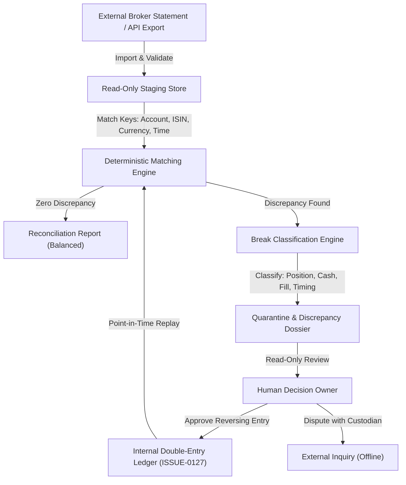

# Source-of-Truth and Reconciliation Architecture

This architecture specification governs source-of-truth boundaries and read-only statement reconciliation for the ETF AI Cockpit, satisfying ISSUE-0066 (`issues/open.md:1458-1474`).

## 1. Scope and Non-Goals

### Scope
- Define authoritative stores, legal writers, and domain tags across portfolio, paper, and broker facts.
- Specify the read-only reconciliation workflow comparing internal ledgers with external broker statements.
- Establish bitemporal identity, decimal precision, idempotency, and fail-closed operational invariants.

### Non-Goals and Non-Negotiable Boundaries
- **No execution authority:** `execution_allowed=false` is enforced globally (`docs/architecture/SDD.md:71`, `configs/authority_matrix.yaml:4`). No broker, provider, or live-order write authority exists or is granted (`docs/architecture/ADR-0070-product-scope-and-authority.md:17-23`).
- **Websockets are not a source of truth:** Ephemeral socket feeds and status callbacks cannot establish state without statement or snapshot confirmation (`issues/open.md:1466`).
- **No automated trade compensation:** Breaks are never auto-corrected or auto-balanced. Reconciliation is strictly read-only; all corrections require human review and manual reversing entries.
- **No retry storms:** Reconnection or sync failures back off deterministically and fail closed without repeated submission (`issues/open.md:1468`).

## 2. Source-of-Truth Map per Fact Type

| Fact Type | Current Implementation | PROPOSED Target Store | Authoritative Writer | Authority Domain |
|---|---|---|---|---|
| Target Portfolio & Weights | `src/etf_cockpit/portfolio/allocation.py:8-29` | Same | User via validated settings | `local_planning` |
| Advisory Proposals | `src/etf_cockpit/portfolio/proposal_policy.py:1-8` | Proposal Ledger (`ISSUE-0130`) | Proposal policy kernel | `local_advisory` |
| Paper Trades & Positions | `src/etf_cockpit/portfolio/paper_trading.py:22-46` | Paper Account Ledger (`ISSUE-0129`) | Paper simulation engine | `paper` |
| Staged Historical Imports | `src/etf_cockpit/data/portfolio_imports.py:38-76` | Same (`portfolio_import_stage_v1`) | Import preview service | `local_import` |
| Portfolio Positions & Cash | `src/etf_cockpit/data/portfolio_imports.py:519-543` | Double-Entry Ledger (`ISSUE-0127`) | Journal posting engine | `ledger` |
| External Broker Positions | Unavailable (`configs/authority_matrix.yaml:23`) | Broker Sync Store (`ISSUE-0131`) | External broker statement | `broker_statement` |
| External Fills & Executions | Unavailable (`configs/authority_matrix.yaml:24`) | External Fill Store (`ISSUE-0131`) | External execution venue | `broker_execution` |
| Cash Reservations (In-Flight)| Unavailable (`src/etf_cockpit/portfolio/rebalancing.py:22`) | Reservation Ledger (`ISSUE-0167`) | Pre-trade risk controls | `cash_reservation` |
| Corporate Actions & FX | `src/etf_cockpit/data/market_adjustments.py:40-50` | Adjustment Journal (`ISSUE-0127`) | Corporate action store | `market_reference` |

## 3. Reconciliation Flow

1. **Import (Read-Only Ingest):** Import broker statements or read-only API snapshots (`ISSUE-0131`). As implemented in `src/etf_cockpit/data/portfolio_imports.py:214-272`, sources are SHA-256 fingerprinted, validated against schema and decimal boundaries, and registered without mutating active books.
2. **Match (Deterministic Comparator):** Compare internal point-in-time replay (`src/etf_cockpit/data/portfolio_imports.py:519-543`, `PROPOSED: ISSUE-0127`) with external statement lines. Matching uses canonical instrument identity (`src/etf_cockpit/data/portfolio_imports.py:134-140`), account identifier, currency code, and timestamp bounds.
3. **Break Classification:**
   - *Position break:* Share quantity divergence, missing statement asset, or unrecognised custody holding.
   - *Cash break:* Account currency balance discrepancy, uncredited dividend/coupon, or unexpected fee/tax deduction.
   - *Fill break:* Trade execution price, volume mismatch, or unacknowledged execution commission.
   - *Timing / Settlement break:* Trade pending clearance ($T+1$/$T+2$) vs settled cash (`ISSUE-0167`).
4. **Human Review (PROPOSED):** Breaks are quarantined into structured reports. No automated adjustment entry is generated. Discrepancies are resolved solely through manual operator investigation and explicit append-only reversing entries (`ISSUE-0127` AC3).

## 4. Identity and Point-in-Time Rules

- **Bitemporal Chronology:** Records enforce two distinct temporal dimensions: `occurred_at` (event effective date) and `decision_time` / `known_at` (knowledge ingestion timestamp) (`src/etf_cockpit/data/portfolio_imports.py:131-132`, `docs/architecture/SDD.md:305-307`). Queries never observe facts known after decision time.
- **Idempotent Identifiers:** External and internal transactions use deterministic SHA-256 event keys (`src/etf_cockpit/data/portfolio_imports.py:337-340`). Repeated delivery of identical records results in an idempotent no-op (`src/etf_cockpit/data/portfolio_imports.py:314-322`).
- **Decimal Precision:** All quantities, prices, fees, and currency balances use fixed-precision `Decimal` representation (`src/etf_cockpit/data/portfolio_imports.py:13-14`, `507-518`). Floating-point arithmetic in accounting logic is prohibited.
- **Append-Only Immutability:** Historical entries cannot be modified or deleted. Corrections append a new reversing entry linking the prior `event_id` (`src/etf_cockpit/data/local_storage.py:220-230`, `PROPOSED: ISSUE-0127`).
- **Replay from Inception:** Current balances, positions, and cost lots are computed purely as projections by deterministic replay from zero (`src/etf_cockpit/data/portfolio_imports.py:1-6`, `519-550`).

## 5. Failure Modes (Failing Closed)

- **Network Interruption or Timeout:** Adapter halts sync and transitions to degraded read-only state (`docs/product-completion/sources/2026-07-21/ETF_AI_Cockpit_Final_Release_Implementation_Spec_2026-07-21.md:2663`). No automatic resubmission or retry storms (`issues/open.md:1468`). Local research and paper modes remain isolated and operational (`src/etf_cockpit/portfolio/paper_trading.py:24`).
- **Unresolved Break:** An active break locks proposal generation and execution eligibility for affected accounts and instruments (`docs/product-completion/sources/2026-07-21/ETF_AI_Cockpit_Final_Release_Implementation_Spec_2026-07-21.md:2730`).
- **Clock Skew and Chronology Violations:** Events arriving with timestamps older than the validated high-water mark or beyond future tolerance are quarantined (`src/etf_cockpit/data/portfolio_imports.py:242`).
- **Duplicate Callback Floods:** Deduplicated against the canonical transactional index (`src/etf_cockpit/data/local_storage.py:228`) without creating journal entries.
- **Credential Leakage Prevention:** Secrets are stored in OS-protected vaults and never logged, exported, or surfaced in UI/error payloads (`docs/product-completion/sources/2026-07-21/ETF_AI_Cockpit_Final_Release_Implementation_Spec_2026-07-21.md:2664`, `3242-3246`).

## 6. Relationship to Programme Issues

- **ISSUE-0127 (Double-Entry Ledger):** Serves as internal source of truth. Schema migration v5 provides double-entry journal balance constraints, trial balance, and replay from inception (`docs/product-completion/sources/2026-07-15/ETF_AI_Cockpit_New_Issues_Ready_To_Append.md:2914-2918`). Tax is restricted to optional bookkeeping metadata without advice (`docs/product-completion/sources/2026-07-21/ETF_AI_Cockpit_Final_Release_Implementation_Spec_2026-07-21.md:3227-3230`).
- **ISSUE-0131 (Broker Adapter Contracts):** Establishes read-only external interfaces and imported statement parsers. Supplies external facts for reconciliation without grant of write authority (`docs/product-completion/sources/2026-07-15/ETF_AI_Cockpit_New_Issues_Ready_To_Append.md:3086-3132`).
- **ISSUE-0132 (Pre-Trade Controls & Kill Switches):** Evaluates exposure, concentration, and turnover limits against reconciled broker state. Reconciliation breaks immediately trigger operational kill switches (`docs/product-completion/sources/2026-07-15/ETF_AI_Cockpit_New_Issues_Ready_To_Append.md:3135-3181`).
- **ISSUE-0133 (Staged Canary Live Execution):** Gated future execution tier requiring certified paper, read-only reconciliation, and control evidence before any live submission is permitted (`docs/product-completion/sources/2026-07-15/ETF_AI_Cockpit_New_Issues_Ready_To_Append.md:3184-3200`).
- **ISSUE-0167 (Settlement & Cash Reservation Accounting):** Accounts for settlement lag ($T+1$/$T+2$) and reserves cash for in-flight orders, preventing double-allocation prior to fill settlement (`issues/open.md:1831-1842`).

## 7. Acceptance Checklist (ISSUE-0066 Mapping)

- [x] **Idempotent Order IDs:** Deterministic SHA-256 client order and event identification specified (`Section 4`).
- [x] **Broker Reconciliation Loop:** Read-only import, match, break classification, and human review loop defined (`Section 3`).
- [x] **Partial-Fill Handling:** Incremental lot updates and proportionate cash reservation release defined (`Sections 2, 3`).
- [x] **Cancellation Handling:** Non-destructive cancellation states and reservation releases specified (`Sections 2, 4`).
- [x] **No Retry Storms:** Deterministic fail-closed timeout and backoff policies enforced (`Sections 1, 5`).
- [x] **Decimal Money/Quantity:** Strict fixed-point `Decimal` accounting mandated across all layers (`Section 4`).
- [x] **Source-of-Truth State Map:** Authoritative writers and domain tags mapped for all fact categories (`Section 2`).
- [x] **Append-Only Audit Log:** Immutability, checksum tracking, and audit trace specified (`Sections 4, 5`).
- [x] **Execution Boundaries:** Unconditional `execution_allowed=false` boundary preserved (`Section 1`).
